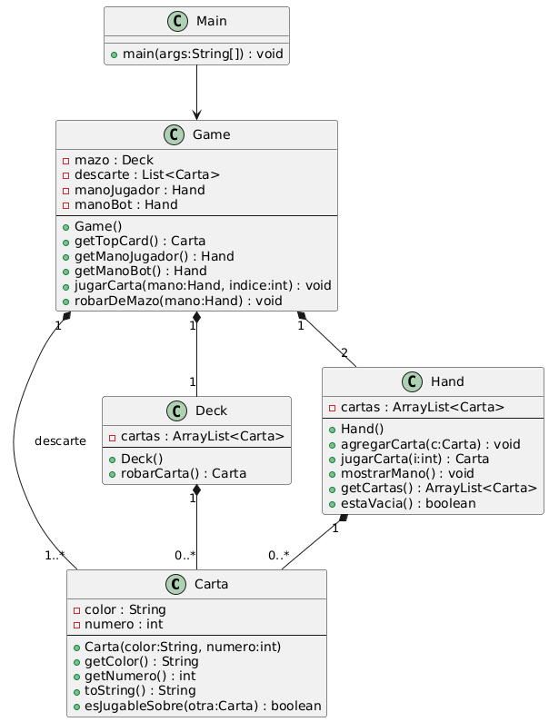
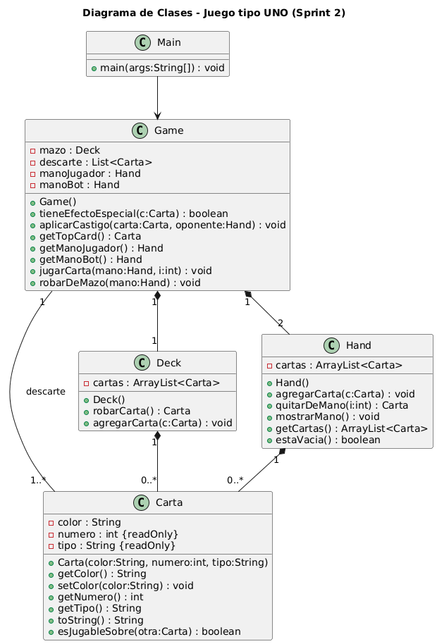
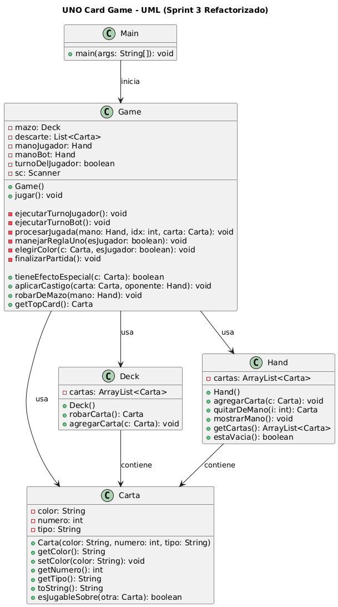
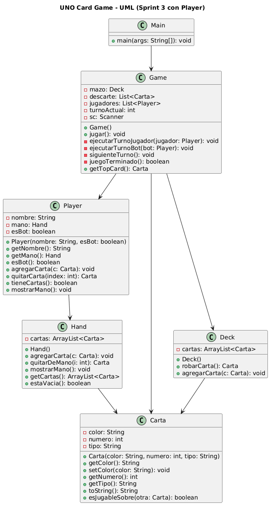

# UNO-card
El presente repositorio contiene el desarrollo de un sistema programado en lenguaje Java, organizado bajo una metodología de trabajo por sprints. Para garantizar una correcta gestión de versiones y un control adecuado de los cambios realizados durante el desarrollo, se implementó el uso de Git como sistema de control de versiones.

---

##  Diagrama UML

---

## 🟡 Sprint 2

### Cambios realizados

- Se agregó el atributo `tipo` a la clase `Carta`
- Se mejoró la lógica del método `esJugableSobre()`
- Se integraron cartas especiales (ej. +2, comodín, etc.)
- Se actualizó el diagrama UML en la carpeta `docs/`

---

##  Actualización del modelo UML

El diseño del sistema se basa en clases principales:

- `Carta`: representa una carta con color, número y tipo  
- `Deck`: maneja el mazo de cartas  
- `Hand`: representa la mano de un jugador  
- `Game`: controla la lógica del juego  
- `Main`: punto de entrada del programa  

📊 UML Sprint 2:

---

## 🔴 Sprint 3 – Refactorización

### Cambios realizados

- Se reorganizó el flujo del juego centralizándolo en la clase `Game`
- Se separaron responsabilidades en métodos específicos (`ejecutarTurnoJugador`, `ejecutarTurnoBot`, `procesarJugada`, etc.)
- Se eliminó código duplicado entre la lógica del jugador y el bot
- Se mejoró la estructura general del sistema aplicando principios de POO
- Se optimizó la legibilidad y mantenibilidad del código
- Se actualizaron los diagramas UML en la carpeta `docs/`

---

### 📊 UML actualizado (Sprint 3)

### 📊 UML actualizado con player (Sprint 3)

### 📊 ¿Por qué se modificó el UML?

El diagrama UML fue actualizado para reflejar la refactorización del sistema realizada en el Sprint 3. 

El cambio principal fue la incorporación de la clase `Player`, la cual permite representar a cada jugador del sistema de manera independiente. Anteriormente, la lógica del juego estaba acoplada a variables específicas para un jugador y un bot, lo que limitaba la escalabilidad.

Con esta modificación:

- Se permite el manejo de múltiples jugadores (2–4)
- Se reduce el acoplamiento en la clase `Game`
- Se mejora la distribución de responsabilidades entre clases
- Se obtiene un diseño más flexible y mantenible

Además, la clase `Game` ahora gestiona una lista de jugadores en lugar de manejar manos individuales, lo que facilita la extensión del sistema hacia futuras mejoras. 