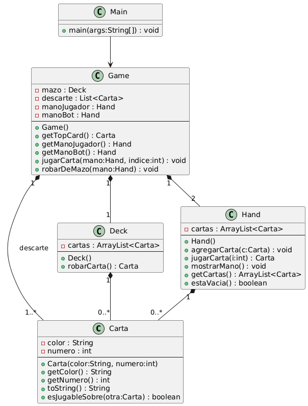
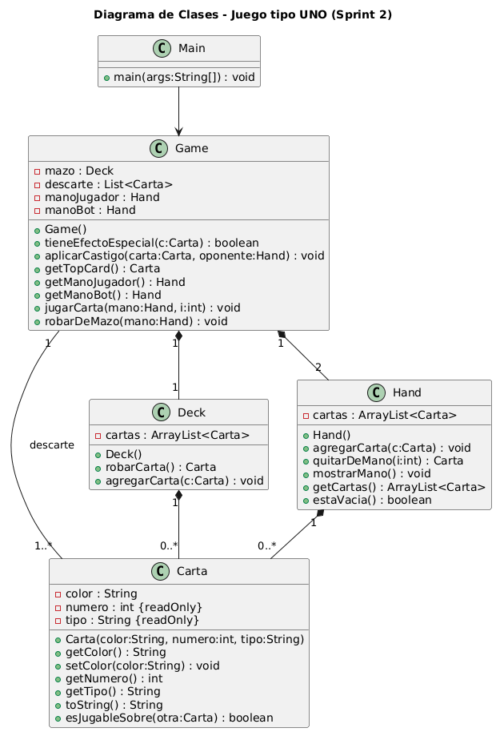
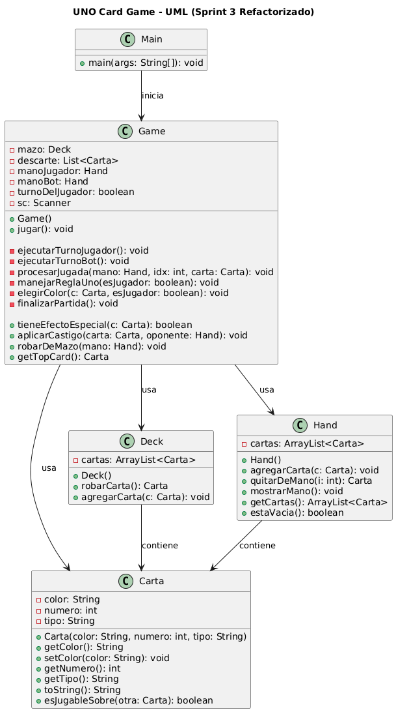
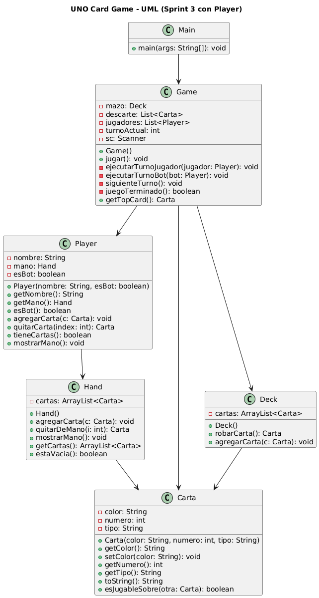
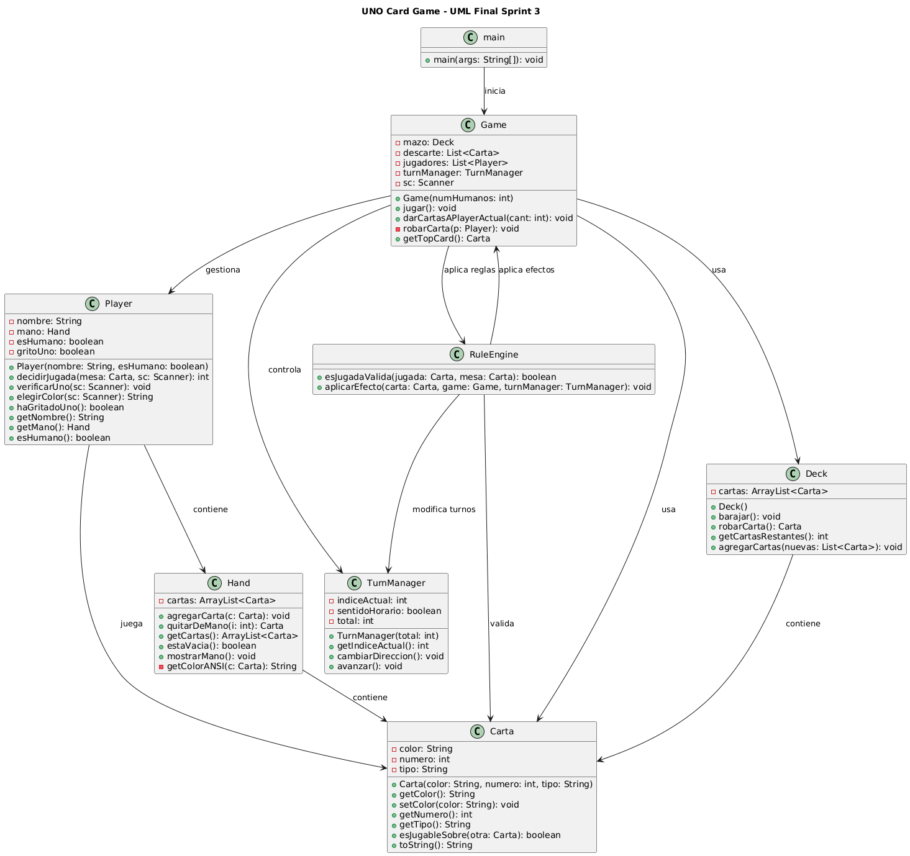
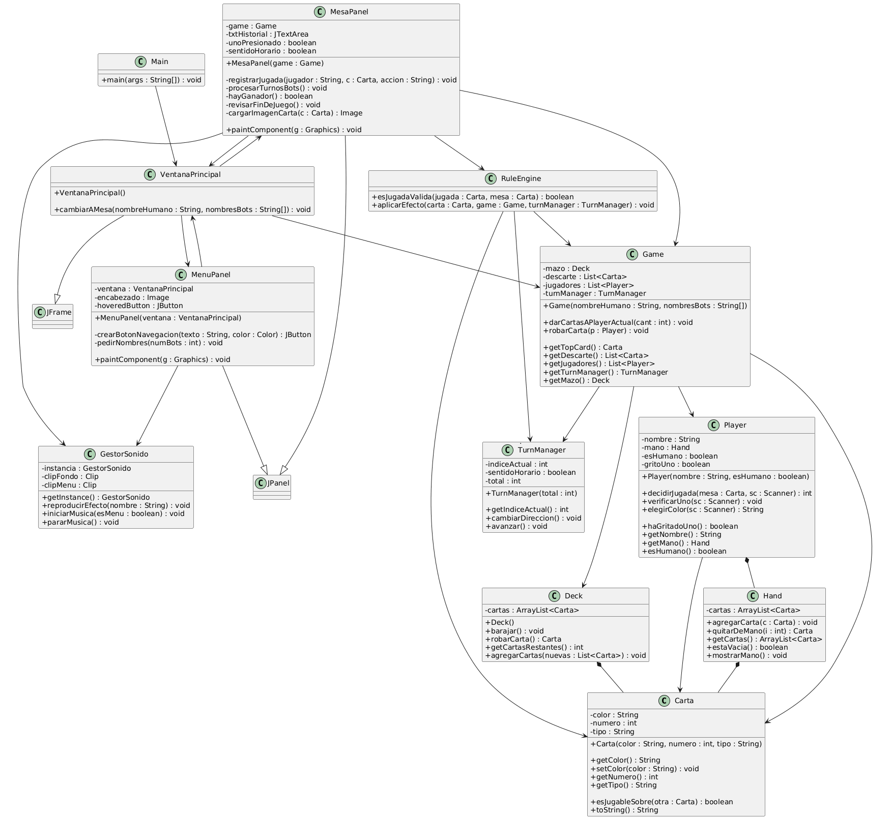

# UNO-card
El presente repositorio contiene el desarrollo de un sistema programado en lenguaje Java, organizado bajo una metodología de trabajo por sprints. Para garantizar una correcta gestión de versiones y un control adecuado de los cambios realizados durante el desarrollo, se implementó el uso de Git como sistema de control de versiones.

---

##  Diagrama UML

---

## 🟡 Sprint 2

### Cambios realizados

- Se agregó el atributo `tipo` a la clase `Carta`
- Se mejoró la lógica del método `esJugableSobre()`
- Se integraron cartas especiales (ej. +2, comodín, etc.)
- Se actualizó el diagrama UML en la carpeta `docs/`

---

##  Actualización del modelo UML

El diseño del sistema se basa en clases principales:

- `Carta`: representa una carta con color, número y tipo  
- `Deck`: maneja el mazo de cartas  
- `Hand`: representa la mano de un jugador  
- `Game`: controla la lógica del juego  
- `Main`: punto de entrada del programa  

📊 UML Sprint 2:

---

## 🔴 Sprint 3 – Refactorización

### Cambios realizados

- Se reorganizó el flujo del juego centralizándolo en la clase `Game`
- Se separaron responsabilidades en métodos específicos (`ejecutarTurnoJugador`, `ejecutarTurnoBot`, `procesarJugada`, etc.)
- Se eliminó código duplicado entre la lógica del jugador y el bot
- Se mejoró la estructura general del sistema aplicando principios de POO
- Se optimizó la legibilidad y mantenibilidad del código
- Se actualizaron los diagramas UML en la carpeta `docs/`

---

### 📊 UML actualizado (Sprint 3)

### 📊 UML actualizado con player (Sprint 3)

### 📊 ¿Por qué se modificó el UML?

El diagrama UML fue actualizado para reflejar la refactorización del sistema realizada en el Sprint 3. 

El cambio principal fue la incorporación de la clase `Player`, la cual permite representar a cada jugador del sistema de manera independiente. Anteriormente, la lógica del juego estaba acoplada a variables específicas para un jugador y un bot, lo que limitaba la escalabilidad.

Con esta modificación:

- Se permite el manejo de múltiples jugadores (2–4)
- Se reduce el acoplamiento en la clase `Game`
- Se mejora la distribución de responsabilidades entre clases
- Se obtiene un diseño más flexible y mantenible

Además, la clase `Game` ahora gestiona una lista de jugadores en lugar de manejar manos individuales, lo que facilita la extensión del sistema hacia futuras mejoras. 

---

### Refactorización Final

### Cambios realizados

* Se implementó la clase `Player` para representar jugadores humanos y bots de forma independiente
* Se agregó la clase `TurnManager` para controlar el flujo de turnos y el sentido de juego (reversa)
* Se agregó la clase `RuleEngine` para separar las reglas del juego y los efectos de cartas especiales
* Se mejoró el sistema de penalización de la regla UNO
* Se implementó el reabastecimiento automático del mazo cuando se terminan las cartas
* Se optimizó la lógica de bots para seleccionar mejores jugadas
* Se redujo el acoplamiento de la clase `Game`, distribuyendo responsabilidades entre nuevas clases
* Se actualizó el diagrama UML en la carpeta `docs/`

---

## UML actualizado (Final)

### ¿Por qué se modificó el UML?

El modelo UML fue actualizado para reflejar la refactorización completa del sistema realizada en el Sprint final.

Anteriormente, gran parte de la lógica del juego estaba concentrada en la clase `Game`, lo que generaba alto acoplamiento y dificultaba la escalabilidad del sistema.

Con la nueva estructura:

* `Player` representa cada jugador individualmente
* `TurnManager` controla el flujo y dirección de turnos
* `RuleEngine` gestiona la validación de jugadas y efectos especiales

Esto permitió un diseño más modular, mantenible y escalable, alineado con buenas prácticas de Programación Orientada a Objetos.

---

### Sprint Final – Implementación de Interfaz Gráfica

### Cambios realizados

* Se implementó una interfaz gráfica completa utilizando Java Swing  
* Se agregó la clase `VentanaPrincipal` para administrar las pantallas del sistema  
* Se desarrolló `MenuPanel` como menú principal interactivo del juego  
* Se implementó `MesaPanel` para representar visualmente la mesa de juego y las cartas  
* Se integró un sistema gráfico dinámico para mostrar jugadores, turnos y cartas en tiempo real  
* Se añadieron efectos visuales y retroalimentación interactiva para mejorar la experiencia del usuario  
* Se implementó un sistema de historial de jugadas dentro de la interfaz  
* Se agregaron botones interactivos para robar cartas, gritar UNO y acceder al menú de configuración  
* Se integró música de fondo y efectos de sonido mediante la clase `GestorSonido`  
* Se añadieron animaciones visuales simples y cambios de color según el estado del juego  
* Se adaptó la lógica existente del proyecto para trabajar correctamente con la interfaz gráfica  
* Se actualizaron los diagramas UML incluyendo las nuevas clases visuales del sistema  

---

## UML actualizado con Interfaz Gráfica

### ¿Por qué se modificó el UML?

El modelo UML fue actualizado nuevamente para reflejar la incorporación de la capa gráfica del sistema.

Anteriormente, el proyecto funcionaba únicamente mediante consola, enfocándose principalmente en la lógica del juego. Con la implementación de la interfaz gráfica, el sistema evolucionó hacia una arquitectura más completa e interactiva.

Con esta actualización:

* `VentanaPrincipal` administra el flujo de ventanas y pantallas  
* `MenuPanel` controla la navegación inicial del juego  
* `MesaPanel` representa visualmente la partida y la interacción del usuario  
* `GestorSonido` administra música y efectos de sonido del sistema  

La incorporación de estas clases permitió separar la lógica visual de la lógica del juego, mejorando la organización del proyecto, la experiencia del usuario y la mantenibilidad del código.